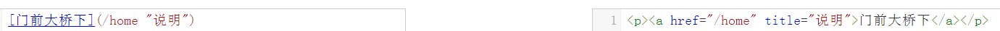

## Markdown 书写规则

### 1.标题的几种写法

* #### #式写法

```markdown
# 一级标题 [# ]
## 二级标题 [## ]
### 三级标题 [### ]
#### 四级标题 [#### ]
##### 五级标题 [##### ]
###### 六级标题 [###### ]
```

> 前面带#号，后面带文字，分别表示h1-h6,上图可以看出，只到h6，而且h1下面会有一条横线，注意，#号后面有空格.

* #### 特殊标题写法

```markdown
这是一级标题(=== 可以很长）
===

二级标题(--- 可以很长)
---
```

> 这种方式好像只能表示一级和二级标题，而且=和-的数量没有限制，只要大于一个就行

* #### #标签闭合

```markdown
  # 一级标题 #
  ## 二级标题 ##
```

> 推荐使用第一种,比较简洁。[markdown在线编辑工具](http://tool.oschina.net/markdown/)

---

### 2.列表

* #### 无序列表

```markdown
    * 1
    * 2
    * 3
    + 1
    + 2
    + 3
    - 1
    - 2
    - 3
```

> 无序列表可以用* ， + ， — 来创建, **推荐用\***

* #### 有序列表

```markdown
1. item1
2. item2
3. item3
```

```markdown
3. item1
2. item2
1. item3
```

> 注意，数字后面的点只能是英文的点，特别注意: 有序列表的序号是根据第一行列表的数字顺序来的(3->2->1则为3->4->5 根据3排序)

---

### 3.区块引用

> 想对某个部分做的内容做一些说明或者引用某某的话等

```markdown
* hello world！
    > 入门必备
```

examples:

* hello world！
    > 入门必备

> 无序列表下方的便是引用，可以有多种用途，看你的需求了，用法就是在语句前面加一个 > ，注意是英文的那个右尖括号，注意空格;
> 引用因为是一个区块，理论上是应该什么内容都可以放，比如说：标题，列表，引用等等

* #### 嵌套引用

```markdown
> 一级引用
>> 二级引用
>>> 三级引用
>>>> 四级引用
```

> 一级引用
>> 二级引用
>>> 三级引用
>>>> 四级引用

    想要在上一次引用中嵌套一层引用，只需多加一个>;层嵌套的>是不需要连续在一起的，只要在一行就可以了，中间允许有空格

---

### 4.分隔线

```markdown
***
******
---
- - -  
* * *
-------------------
__ __ __
```

> 分割线可以由* - _（星号，减号，底线）这3个符号的至少3个符号表示，注意至少要3个，且不需要连续，有空格也可以

---

### 5.链接

* 行内式

```markdown
[GitHub](https://www.github.com)托管源代码
```

[GitHub](https://www.github.com)托管源代码

> 链接还可以带title属性，好像也只能带title，带不了其他属性，注意，是链接地址后面空一格，然后用引号引起来


* 参数式

```markdown
[name]:http://www.baidu.com "百度"
[home]:http://www.github.com "GitHub"
[百度]:/home/name "error"

这里是[name],这里是[home],这个是[百度]
```

[name]:http://www.baidu.com "百度"
[home]:http://www.github.com "GitHub"
[百度]:/home/name "error"

这里是[name],这里是[home],这个是[百度]

>把链接当成参数，适合多出使用相同链接的场景，注意参数的对应关系，参数定义时，这3种写法都可以：</br>
`[foo]: http://example.com/ "Optional Title Here"` </br>
`[foo]: http://example.com/ 'Optional Title Here'` </br>
`[foo]: http://example.com/ (Optional Title Here)` </br>
> 还支持这种写法，如果你不想混淆的话：</br>
`[foo]: <http://example.com/> "Optional Title Here"` </br>
> 还有一种隐式链接的写法，那种写法不直观

---

### 6.图片

> 两种方式：行内式、参数式

```markdown

[OAuth]:iamge/oauth-logo-square.png
参数式图片，LOGO[OAuth]
```

[OAuth]:image/oauth-logo-square.png

 参数式图片，LOGO![OAuth]

---

### 7.代码框

> 单行，可以用单反引号包起来

`<p><a href="http://www.github.com" title="GitHub">GitHub</a></p>`

> 多行用三个反引号，如果要写注释，可以在反引号后面写,反引号后面写的语言类型

```html
<p><a href="http://www.github.com" title="GitHub">GitHub</a></p>
<p><a href="http://www.github.com" title="GitHub">GitHub</a></p>
<p><a href="http://www.github.com" title="GitHub">GitHub</a></p>
```

---

### 8.表格

```markdown
 |   name   |    age   |    sex   |
 |:--------:|:--------:|:--------:|
 |   tony   |    20    |    男    |
 |  Shirley |    18    |    女    |

 表头一 | 表头二
-------------|-------------
Content Cell | Content Cell
Content Cell | Content Cell

姓名|性别|分数
-|-|-
胡八一|男|99
Shirley|女|98
王胖子|男|60
```

exp1:

 |   name   |    age   |    sex   |
 |:--------:|:--------:|:--------:|
 |   tony   |    20    |    男    |
 |  Shirley |    18    |    女    |

exp2:

表头一 | 表头二
-------------|-------------
Content Cell | Content Cell
Content Cell | Content Cell

exp3:

姓名|性别|分数
-|-|-
胡八一|男|99
Shirley|女|98
王胖子|男|60

---

### 9.强调

```markdown
*字体倾斜*
_字体倾斜_
**字体加粗**
__字体加粗__
```

> 一个星号或者是一个下划线包起来，会转换为`<em>`倾斜，如果是2个，会转换为`<strong>`加粗

---

### 10.转义

```markdown
* \\
* \`
* \~
* \*
* \_
* \ _
* \+
* \.
* \!
```

---

### 11.删除线

```markdown
~~删了删了~~
```

~~删了删了~~

---

### **参考文献**

[http://www.appinn.com/markdown/](http://www.appinn.com/markdown/)

[http://sspai.com/25137](http://sspai.com/25137)

**[原创博客链接地址](https://www.cnblogs.com/liugang-vip/p/6337580.html)**
